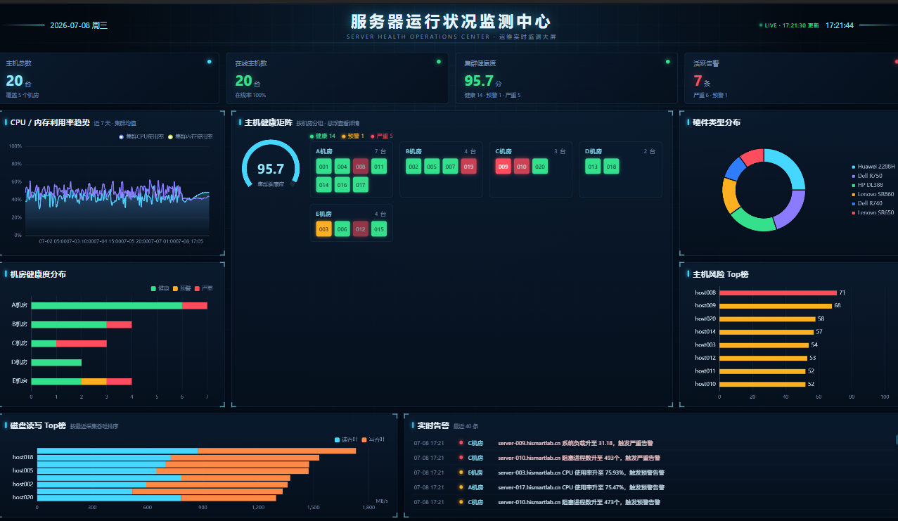

# 服务器运行状况监测大屏（ServerHealthDashboard）



面向运维负责人视角的服务器运行状况实时监测可视化大屏。原始 tsar 采集日志经 ETL 加工后存入 **MySQL**，一个内置的模拟采集器持续写入新的采集点，**Express API** 实时查询聚合，前端 **Vue 3 + TypeScript + ECharts + Pinia** 轮询展示——不是回放静态快照，数据库里的数值在持续变化。

```
data/raw/*.dat --(scripts/load-mysql.mjs 一次性导入)--> MySQL(server_health) <--(server/lib/collector.mjs 每8s写入新采集点/告警)-- API 进程常驻
                                                              |
                                                    server/index.mjs 每次请求实时查询聚合
                                                              |
                                                     GET /api/dashboard --(前端每15s轮询)--> 大屏
```

## 数据来源

`data/raw/` 下的四个原始文件：

- `host_detail.dat`：20 台主机的基础信息（主机名、负责人、机型、机房、机柜）
- `mod_detail.dat`：性能 / 磁盘采集指标的元数据（单位、分类）
- `pref_tsar.dat`：近 7 天、每小时一次的 CPU / 内存 / 网络 / 负载 / 进程采集数据
- `disk_tsar.dat`：稀疏采样的磁盘 IO / 利用率 / 时延数据

## 数据库

MySQL 表结构见 [server/db/schema.sql](server/db/schema.sql)：

- `hosts`：主机基础信息
- `pref_metrics`：性能采集宽表（每小时一条快照）
- `disk_metrics`：磁盘采集，保留原始 EAV 结构（各磁盘/指标采集时刻不对齐）
- `alerts`：基于阈值边缘触发（好转/恶化跳变时才记一条）计算好的告警事件，ETL 导入时批量算一遍历史存量，之后由采集器持续追加新的

`server/lib/metrics.mjs` 定义统一的告警阈值、风险评分公式，ETL 导入脚本 / 实时采集器 / API 聚合逻辑三方共用，保证口径一致。

## 快速开始

```bash
npm install
cp .env.example .env   # 按需修改数据库连接信息
npm run db:load        # 解析 data/raw 写入 MySQL（会自动建库建表并清空重导）
npm run dev             # 同时启动前端(Vite:10010)与后端API(Express:8787)
npm run build            # 类型检查 + 前端生产构建
```

`npm run dev` 用 `concurrently` 并行启动 `dev:client`（Vite，代理 `/api` 到 8787）与 `dev:server`（`node --watch server/index.mjs`）。也可以分别执行 `npm run dev:client` / `npm run dev:server`。

## 实时监测

真正会变化的实时链路，不只是"重复查询同一份历史快照"：

1. **模拟采集器**（`server/lib/collector.mjs`）随 API 进程常驻运行，每 8 秒从数据库里上一条真实记录出发，为全部 20 台主机做一次有界随机游走并写入 `pref_metrics`；同时按统一阈值检测指标跳变，跳变时实时写入新的 `alerts` 记录；约 35% 概率顺带写一条稀疏磁盘采样。每 5 分钟清理超过 7 天的旧数据。
2. **API**（`GET /api/dashboard`）每次请求都重新查询 MySQL 并现场计算健康状态、风险评分、Top榜与告警，不做任何缓存。
3. **前端**每 15 秒轮询一次接口，页面右上角的 LIVE 徽标与"更新时间"反映每次刷新；实时告警面板会出现刚生成的新告警，而不只是导入时的历史记录。

## 页面结构

16:9 自适应大屏（`src/layouts/BigScreenLayout.vue`，1920×1080 舞台按视口等比缩放居中，无滚动条）：

- 顶部：标题 + 实时时钟 + LIVE 刷新徽标
- 指标卡：主机总数 / 在线主机数 / 集群健康度 / 活跃告警
- 主区：CPU/内存利用率趋势、机房健康度分布、主机健康矩阵（按机房分组、悬浮查看详情）、硬件类型分布、主机风险 Top榜
- 底部：磁盘读写 Top榜、实时告警流水
